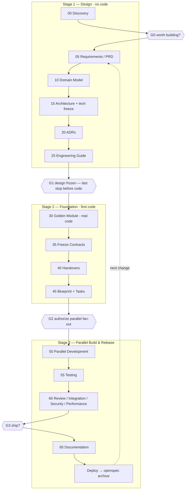

# AEOS User Guide

This is the full guide to building software with AEOS. For **every phase** it
tells you: the command, **when** to run it, **why** it exists, **what** to put in
it, **how** to run it (a copy-paste example), and the **output** you should see.

New here? Read **[getting-started.md](getting-started.md)** first — the
ten-minute version — then come back for the depth.

Throughout we use one running example: adding an **invoicing** feature to a
Laravel app, with the change id `add-invoicing`.

---

## How AEOS works, in one picture

AEOS runs in **three stages** separated by **four human gates**. Design first.
Prove the pattern once by building a single *Golden Module*. Freeze the shared
contracts. Then let many AI agents build the rest in parallel against those
frozen contracts.



Plain-text version of the same flow:

```
STAGE 1 — DESIGN (no code)
  Discovery → [G0] → PRD → Domain Model → Architecture → ADRs → Engineering Guide → [G1]
STAGE 2 — FOUNDATION (first code)
  Golden Module → Freeze Contracts → Handovers → Blueprint + Tasks → [G2]
STAGE 3 — PARALLEL BUILD & RELEASE
  Parallel Dev → Testing → Review/Integration/Security/Performance → [G3] → Docs → Deploy → Archive
```

**Two rules underpin everything:**
1. **Never design while building; never build while designing.** The one
   exception is the Golden Module — real code written to lock the pattern — and
   it's gated on both sides.
2. **Stage 3 agents are blindfolded on purpose.** Each parallel agent receives
   *only* six things: the Golden Module, the Engineering Guide, the Architecture,
   the Contracts, its own Handover, and its own Tasks. Nothing else. That's what
   stops them inventing conflicting patterns.

If you run a command too early, it stops and tells you exactly what's missing.
`/aeos:status` shows where every change stands at any time.

---

## Do I run all 18 phases every time? No.

Running the full pipeline for a one-line bug fix would be absurd. Most phases
build **foundation** — the Golden Module, Engineering Guide, base architecture,
and base contracts — which you build **once** and then *reuse* on every later
change. A change consumes the foundation; it doesn't rebuild it.

Each change declares a **Change-Type** in its G0 record, and that picks the path:

| Change type | Example | What runs | Reuses |
|-------------|---------|-----------|--------|
| **`new-system`** | A brand-new app, or a major new subsystem | **All 18** — the one time you build the Golden Module + foundation | — (creates it) |
| **`new-module`** | Add "invoicing" to an existing app | requirements → domain delta → contracts delta → handover → tasks → implement → test → review | Golden Module, guide, architecture, base contracts |
| **`module-change`** | Change how invoices are numbered | requirements → update handover → tasks → implement → test → review | everything except the one handover |
| **`patch`** | Fix a rounding bug | requirements (impact note) → implement → test → review | everything |

Gates right-size too: **G2 (authorize build)** and **G3 (ship)** always apply;
**G0** is lightweight for small changes; **G1 (design freeze)** only applies when
the change actually does design work. So a bug fix is roughly *four* steps, not
eighteen. Full rules: `aeos/workflows/change-types.md`.

**The rest of this guide walks the full `new-system` path** (building the
foundation). For a smaller change, follow your row above — skip the phases it
doesn't list, and the commands will reuse `.ai/foundation/` automatically.

---

## Stage 1 — Design (documents only, no code)

### Phase 00 · Discovery

| | |
|---|---|
| **Command** | `/aeos:discover <your idea>` |
| **When** | Anytime — this is the start. No gate before it. |
| **Why** | Pin down the *problem* before anyone reaches for a solution. |
| **What to write** | The problem, target users, desired outcomes, constraints, success metrics, open questions. Your input can be a raw idea, a PRD, an SRS, a BRD, or a government ToR. |
| **Output** | `.ai/idea.md` |

**How — example prompt:**
```
/aeos:discover invoicing for our B2B customers — they need to bill clients monthly
```
The AI interviews you, then writes `.ai/idea.md`. Answer its questions; read the
result.

---

### 🚦 Gate G0 · "Worth building?"

| | |
|---|---|
| **Who** | Product owner |
| **When** | After Discovery, before Requirements |
| **Why** | A deliberate pause: is this worth the effort of a full spec? |

**How:** copy `aeos/templates/gate-record.template.md` to
`.ai/reviews/add-invoicing-g0.md`, write your decision, commit it:
```markdown
## Decision
Decision: APPROVED
```
This is where your idea gets its **change id** (`add-invoicing`). Everything
after this shares that id.

---

### Phase 05 · Requirements (PRD)

| | |
|---|---|
| **Command** | `/aeos:requirements add-invoicing` |
| **When** | After G0 is recorded. (The command refuses without it.) |
| **Why** | Turn a rough idea into complete, unambiguous requirements — the *what* and *why*, never the *how*. |
| **What to write** | Functional vs non-functional requirements, user stories, testable acceptance criteria, assumptions, edge cases, impact. It's a full PRD that is also an OpenSpec-valid proposal. |
| **Output** | `openspec/changes/add-invoicing/proposal.md` |

**How — example prompt:**
```
/aeos:requirements add-invoicing
```
Then, if OpenSpec is installed: `openspec validate add-invoicing`. Read and
approve the PRD in conversation.

---

### Phase 10 · Domain Model

| | |
|---|---|
| **Command** | `/aeos:domain add-invoicing` |
| **When** | After the PRD exists. |
| **Why** | Understand and model the business before choosing any technology. |
| **What to write** | Bounded contexts, actors, business rules, workflows, then entities/aggregates/value objects/relationships, the logical data schema, state transitions, validation rules — plus an event-storming pass (events + the commands that trigger them). |
| **Output** | `.ai/domain/add-invoicing/domain-model.md` |

**How — example prompt:**
```
/aeos:domain add-invoicing
```
For a small change you can tell it to keep it light: *"single bounded context,
skip formal event storming."* Read and approve.

---

### Phase 15 · Architecture

| | |
|---|---|
| **Command** | `/aeos:architecture add-invoicing` |
| **When** | After the domain model exists. |
| **Why** | Choose the architecture and **freeze the technology stack** so no tech decisions happen during coding. |
| **What to write** | Architecture style (modular monolith, clean, DDD, CQRS, event-driven…), module boundaries, folder structure, communication rules, event flow, and the frozen stack (DB, cache, queue, auth, storage, etc.). Also the spec deltas (how the system's rules change). |
| **Output** | `openspec/changes/add-invoicing/design.md` + spec deltas |

**How — example prompt:**
```
/aeos:architecture add-invoicing
```
This is the cheapest place to catch a wrong technical direction. Read carefully,
then approve.

---

### Phase 20 · ADRs

| | |
|---|---|
| **Command** | `/aeos:adr add-invoicing` |
| **When** | After the architecture exists. |
| **Why** | Capture the *significant, hard-to-reverse* decisions so future-you knows why. |
| **What to write** | One record per big decision: context, the decision, alternatives considered (and why they lost), consequences, status. Trivial choices don't need one. |
| **Output** | `.ai/adr/add-invoicing/ADR-001-*.md`, `ADR-002-*.md`, … |

**How — example prompt:**
```
/aeos:adr add-invoicing
```

---

### Phase 25 · Engineering Guide (Guardrails)

| | |
|---|---|
| **Command** | `/aeos:guardrails add-invoicing` |
| **When** | After the architecture exists. |
| **Why** | Pin the standards every module must follow so agents don't invent their own patterns. |
| **What to write** | A short per-change sheet that *references* the static `aeos/guide/` (which already ships all 8 areas: coding standards, folder conventions, naming, architectural constraints, DDD rules, SOLID, testing rules, review rules) plus the adapter, with change-specific slots (new folder structure, base abstractions, shared libs) filled or marked TODO. It does **not** rewrite the guide. |
| **Output** | `.ai/engineering-guide/add-invoicing.md` |

**How — example prompt:**
```
/aeos:guardrails add-invoicing
```

---

### 🚦 Gate G1 · "Design frozen — last stop before code"

| | |
|---|---|
| **Who** | Architect / tech lead |
| **When** | After the Engineering Guide. Reviews the *whole* design set (PRD + domain + architecture + ADRs + guide). |
| **Why** | This is the last moment before any code exists. Everything above is cheap to change; nothing below is. |

**How:** record `.ai/reviews/add-invoicing-g1.md` → `Decision: APPROVED`, commit.

---

## Stage 2 — Foundation (first code, frozen contracts, handover package)

### Phase 30 · Golden Module

| | |
|---|---|
| **Command** | `/aeos:golden add-invoicing` |
| **When** | After G1 (the command refuses without it — no code before G1). |
| **Why** | Build **one complete module** perfectly. It becomes the reference every other module copies. Prove the pattern once. |
| **What to write** | Real, tested code for one representative module: folder layout, API style, validation, repository, service, full passing tests, docs — plus a written tour of it. |
| **Output** | The reference module on a branch + `.ai/golden/add-invoicing/golden-module.md` |

**How — example prompt:**
```
/aeos:golden add-invoicing
```
Pick the most representative module (usually a typical wave-1 one). Review the
result as if you were setting the standard for the whole project — because you
are.

---

### Phase 35 · Freeze Contracts

| | |
|---|---|
| **Command** | `/aeos:contracts add-invoicing` |
| **When** | After the Golden Module exists (it proves the contract shapes in practice). |
| **Why** | Lock every interface modules share so parallel agents can't collide. |
| **What to write** | The frozen set: APIs, DTOs, domain events, interfaces, database contracts, message formats — marked FROZEN with a version and date. |
| **Output** | `.ai/contracts/add-invoicing/contracts.md` |

**How — example prompt:**
```
/aeos:contracts add-invoicing
```
Once frozen, **no agent changes a contract on its own.** A change goes back
through `/aeos:requirements` with an impact note.

---

### Phase 40 · Handovers

| | |
|---|---|
| **Command** | `/aeos:handover add-invoicing` |
| **When** | After contracts are frozen. |
| **Why** | Give each module a complete "instruction manual" so one AI engineer can build it without re-reading the whole design. This is the most important document in the lifecycle. |
| **What to write** | One document per module: business goal, requirements, use cases, acceptance criteria, database design, APIs, events, dependencies, constraints, coding rules, testing requirements, Do's and Don'ts, and a hard Out-of-Scope boundary. APIs/events must match the frozen contracts. |
| **Output** | `.ai/handovers/add-invoicing/<module>.handover.md` (one per module) |

**How — example prompt:**
```
/aeos:handover add-invoicing
```

---

### Phase 45 · Blueprint + Tasks

| | |
|---|---|
| **Command** | `/aeos:tasks add-invoicing` |
| **When** | After handovers exist. |
| **Why** | Produce the execution plan (what runs in parallel, in what order) and slice each handover into small, buildable tasks. |
| **What to write** | The **Implementation Blueprint** — module order, dependency graph, parallel waves (Golden Module is wave 0), shared components, risks — plus one atomic **task** file per unit of work, each with `depends_on`, a wave number, and a runnable verification command. |
| **Output** | `.ai/blueprint/add-invoicing/blueprint.md` + `openspec/changes/add-invoicing/tasks/` |

**How — example prompt:**
```
/aeos:tasks add-invoicing
```

Example blueprint waves:
```
Wave 0 — invoice-core        (the Golden Module, already built)
Wave 1 — invoice-pdf, invoice-notifications   (independent, run together)
Wave 2 — invoice-reports     (depends on wave 1)
```

---

### 🚦 Gate G2 · "Authorize parallel fan-out"

| | |
|---|---|
| **Who** | Tech lead |
| **When** | After Tasks. Reviews the golden module, frozen contracts, handovers, blueprint, and tasks together. |
| **Why** | **The most important gate.** Nothing parallel runs without it — it's the moment before the design is multiplied across every module. |

**How:** record `.ai/reviews/add-invoicing-g2.md` → `Decision: APPROVED`, commit.

---

## Stage 3 — Parallel Build & Release

### Phase 50 · Parallel Development

| | |
|---|---|
| **Command** | `/aeos:implement add-invoicing T-001` (or hand tasks to Conductor) |
| **When** | After G2. |
| **Why** | Build all modules at once, each agent imitating the Golden Module. |
| **What each agent gets** | **Only** six things: Golden Module · Engineering Guide · Architecture · Contracts · its own Handover · its own Tasks. Nothing else. |
| **Output** | One reviewed-ready branch per task. |

**How — example brief (per agent / Conductor workspace):**
```
Implement task openspec/changes/add-invoicing/tasks/T-001.md.
Read your handover and follow aeos/prompts/50-implementation.md.
Imitate the Golden Module. Build against the frozen contracts. Do not touch
files outside your module scope.
```
Start **wave 1 only**, one workspace per task. A task is done when its Definition
of Done is checked **and** its verification command passes. If an agent hits a
design gap, it **reports back** — it never improvises.

---

### Phase 55 · Testing

| | |
|---|---|
| **Command** | `/aeos:report add-invoicing` |
| **When** | After a wave is merged. |
| **Why** | Generate and run the test suite; measure real coverage against each handover's testing expectations. |
| **Output** | `.ai/reports/add-invoicing/report-test-coverage.md` |

```
/aeos:report add-invoicing
```

---

### Phase 60 · Review · Integration · Security · Performance

| | |
|---|---|
| **Command** | `/aeos:review add-invoicing <type>` |
| **When** | Per finished branch (code-review) and on merged waves (the rest). |
| **Why** | AI reviews AI: catch SOLID/DDD/architecture violations, verify the modules compose, and harden for production. |
| **What to write** | Evidence-backed verdicts — a finding must name a location and a recommendation. |
| **Output** | `.ai/reports/add-invoicing/report-<type>.md` |

**How — one command per review type:**
```
/aeos:review add-invoicing code-review        # per branch; merge only on PASS
/aeos:review add-invoicing integration         # do the modules fit together?
/aeos:review add-invoicing security            # OWASP, authz, injection…
/aeos:review add-invoicing performance         # caching, indexing, queries
/aeos:review add-invoicing release-readiness   # aggregates the others
```
Merge a branch only when its code review passes. **Wave N+1 starts only after
wave N is merged.**

---

### 🚦 Gate G3 · "Ship?"

| | |
|---|---|
| **Who** | Release owner |
| **When** | After all reports exist. |
| **Why** | The final go/no-go, backed by evidence. |

**How:** record `.ai/reviews/add-invoicing-g3.md` → `Decision: APPROVED`, commit.

---

### Phase 65 · Documentation & Handover

| | |
|---|---|
| **Command** | `/aeos:docs add-invoicing` |
| **When** | After G3. |
| **Why** | Leave the running system fully documented for operators and the next change. |
| **What to write** | An index/handover: API docs, architecture docs, ADR index, deployment guide, runbooks, developer guide (pointing to existing artifacts). |
| **Output** | `.ai/reports/add-invoicing/documentation.md` |

```
/aeos:docs add-invoicing
```

---

### Deploy and archive

Deploy however your project deploys. Then close the loop:
```bash
openspec archive add-invoicing
```
The spec deltas fold into `openspec/specs/` — current truth now includes
invoicing — and the change folder archives. The next change starts from an
accurate picture of the system.

---

## Continuous evolution (the next change)

Once live, every new feature follows the *same* pipeline. A change request
re-enters at `/aeos:requirements` with an added impact-analysis note (which
contracts and handovers are affected). No direct coding — only controlled
evolution.

---

## Command quick reference

| Stage | Phase | Command | Output |
|-------|-------|---------|--------|
| 1 | Discovery | `/aeos:discover <idea>` | `.ai/idea.md` |
| 1 | *G0* | *(record)* | `.ai/reviews/<id>-g0.md` |
| 1 | Requirements | `/aeos:requirements <id>` | `proposal.md` (PRD) |
| 1 | Domain | `/aeos:domain <id>` | `domain-model.md` |
| 1 | Architecture | `/aeos:architecture <id>` | `design.md` + deltas |
| 1 | ADR | `/aeos:adr <id>` | `ADR-*.md` |
| 1 | Guardrails | `/aeos:guardrails <id>` | `engineering-guide.md` |
| 1 | *G1* | *(record)* | `.ai/reviews/<id>-g1.md` |
| 2 | Golden Module | `/aeos:golden <id>` | reference module + `golden-module.md` |
| 2 | Contracts | `/aeos:contracts <id>` | `contracts.md` (FROZEN) |
| 2 | Handover | `/aeos:handover <id>` | handover per module |
| 2 | Blueprint + Tasks | `/aeos:tasks <id>` | `blueprint.md` + tasks |
| 2 | *G2* | *(record)* | `.ai/reviews/<id>-g2.md` |
| 3 | Parallel Dev | `/aeos:implement <id> <task>` | branch per task |
| 3 | Testing | `/aeos:report <id>` | test coverage report |
| 3 | Review | `/aeos:review <id> <type>` | review reports |
| 3 | *G3* | *(record)* | `.ai/reviews/<id>-g3.md` |
| 3 | Documentation | `/aeos:docs <id>` | documentation index |
| — | Status (any time) | `/aeos:status` | lifecycle table |

---

## The rules that keep you safe

1. **Never design while building; never build while designing** (except the
   gated Golden Module). A gap found mid-build is reported, not improvised.
2. **Each phase writes only where it's allowed** — the table in `CLAUDE.md` is
   the authority.
3. **Don't edit `aeos/` during a project** — it's the framework, synced from
   upstream.
4. **Gates are files.** If it isn't in `.ai/reviews/`, it didn't happen.
5. **Frozen contracts and module boundaries are walls, not suggestions.**

---

## The lite path (small changes)

See **[Do I run all 18 phases every time?](#do-i-run-all-18-phases-every-time-no)**
above — the Change-Type you set at G0 decides which phases run. A `patch` is
about four steps; a `new-module` reuses the whole foundation and skips the
golden module. The gates that matter (G2 authorize, G3 ship) still apply — the
ceremony scales to the size of the work, the safety doesn't.

---

## Troubleshooting

| What you see | Why | What to do |
|--------------|-----|------------|
| A command stops immediately | Its gate record or input document is missing | `/aeos:status` names the exact missing piece |
| `openspec validate` fails | The PRD/deltas don't follow OpenSpec conventions | Fix the flagged file; `.ai/` files aren't validated by the CLI |
| An agent wants to change another module | Task boundaries drawn wrong | Stop it; fix the blueprint/tasks in Stage 2, re-approve G2 — don't patch around it |
| An agent wants to change a contract | Contract is wrong or incomplete | Stop; re-enter at `/aeos:requirements` with an impact note — never edit a frozen contract in code |
| Two modules disagree about an API | Handovers don't match the contracts | Fix at `/aeos:handover`, not in code |
| "Where am I?" | — | `/aeos:status`, any time |
